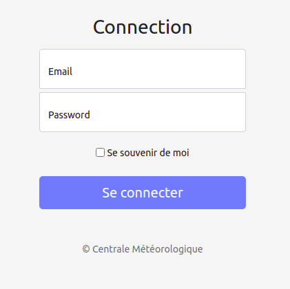

# Présentation de l'application web réalisée

L'application consiste en un ensemble d'interfaces utilisateurs permettant entre autres :

- de consulter les informations des différents capteurs;
- d’enregistrer un nouveau capteur;
- d’enregistrer un nouveau compte utilisateur;
- de créer des tables personnalisées (table météo par exemple);
- d’associer une table à un utilisateur donné;
- de supprimer et de mettre à jour des informations d'une table personnalisée;
- de visualiser les opérations statistiques d'une table sur une période donnée;

## Connexion

Vous renseignez votre email et mot de passe de connexion

  
*Page d'authentification.*

Si vos informations sont correctes, le système vous redirige vers la page de vos tables personnalisées.
