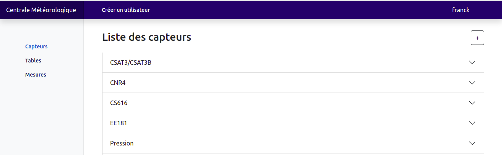
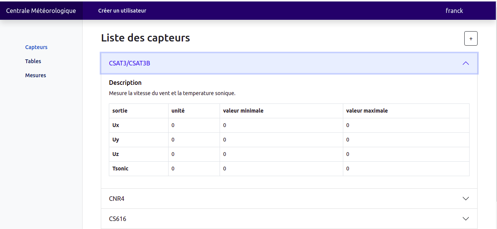
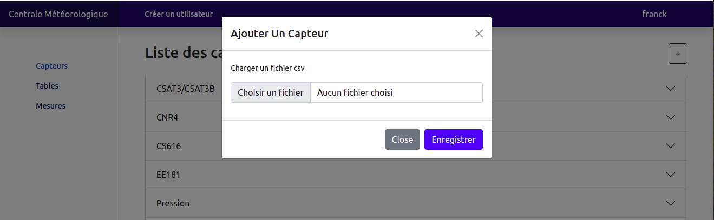
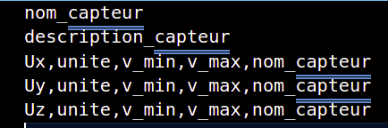

#  Opération sur les capteurs

## Liste des capteurs

Le système affiche la liste des capteurs existant sur la centrale

  
*Liste des capteurs.*

 
 

  
*Information détaillée sur les capteurs.*
 

## Enregistrer un capteur

Après ajout d'un nouveau capteur à la centrale physique, nous pouvons renseigner ce nouveau capteur au système

  
*Enregistrement d'un nouveau capteur dans le système.*
 

## Charger le fichier **nom_capteur.csv**

Afin d'enregistrement le nouveau capteur, vous devez éditer un fichier csv renseignant les lignes suivante :

- le nom du capteur;
- la description du capteur
- la sortie, l'unité, la valeur minimale et maximale correspondante, ainsi que le nom du capteur à nouveau;

Soit :

  
*nom_capteur.csv.*
