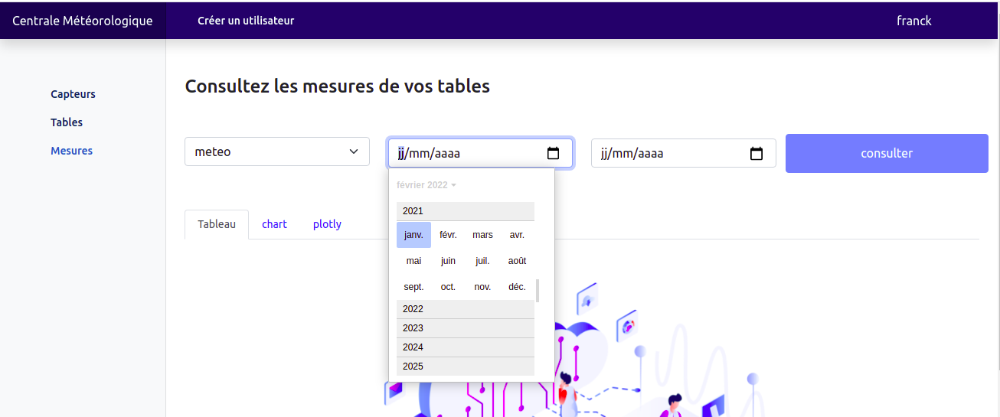
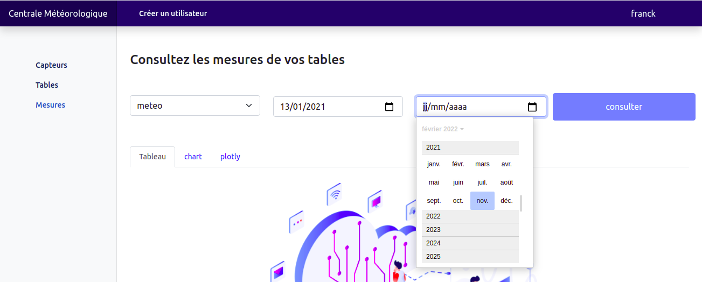
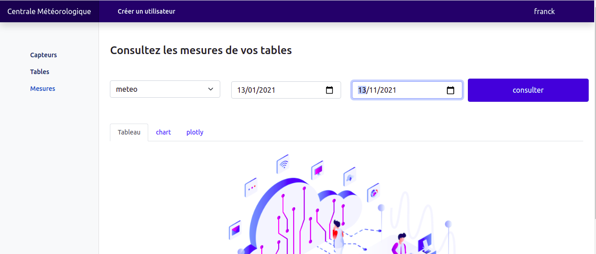
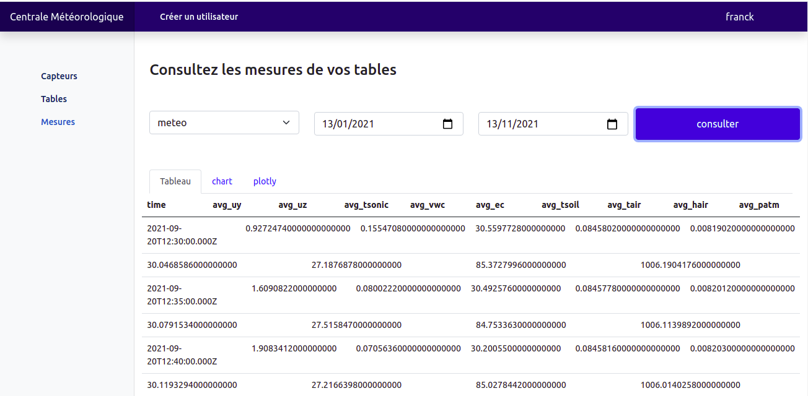
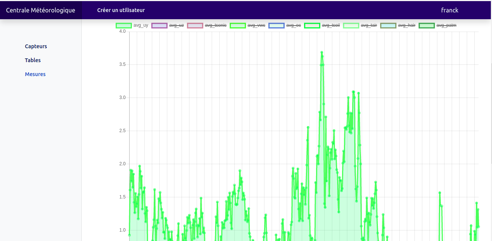
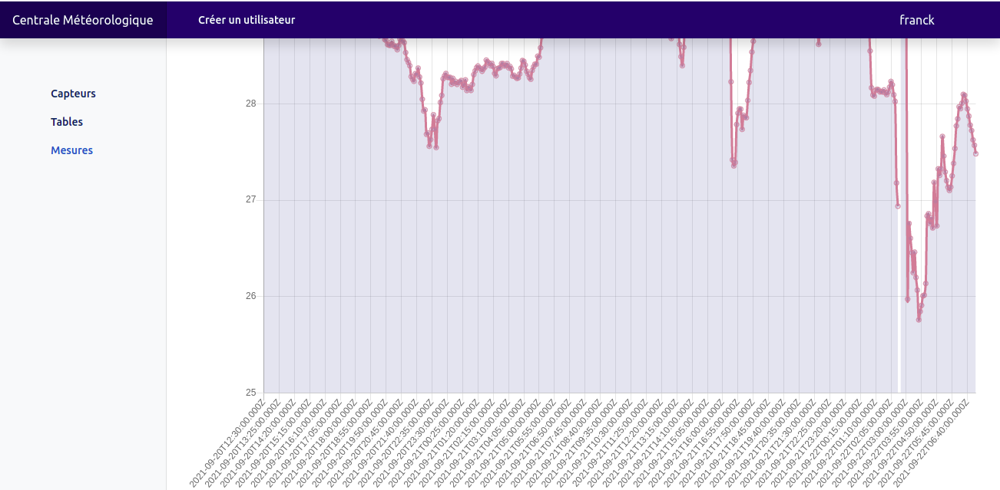
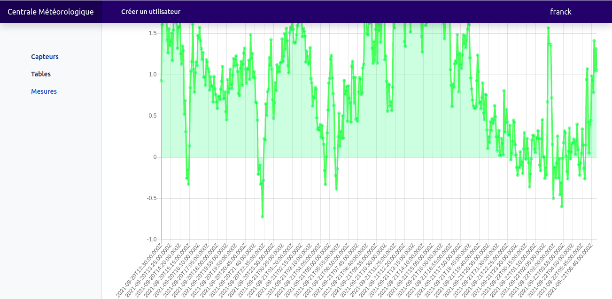

#  Consultation des mesures de chaque table

Selon les tables associées à utilisateur, il peut consulter le résultat des opérations appliquées aux variables de la table sur une période qu'il renseignera.

  
*renseignement de l'intervalle début-fin.*

 
 

  
*renseignement de l'intervalle début-fin.*

 
 

  
*renseignement de l'intervalle début-fin.*

 
 

  
*résultat sous forme de tableau.*

 
 

  
*résultat sous forme de graphe.*

 
 

  
*résultat sous forme de graphe.*

 
 

  
*résultat sous forme de graphe.*

 
 