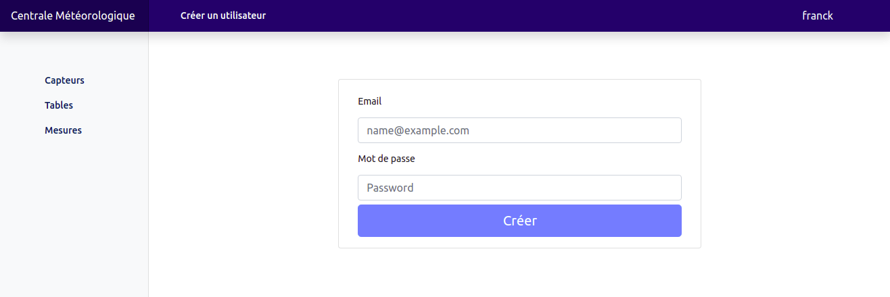
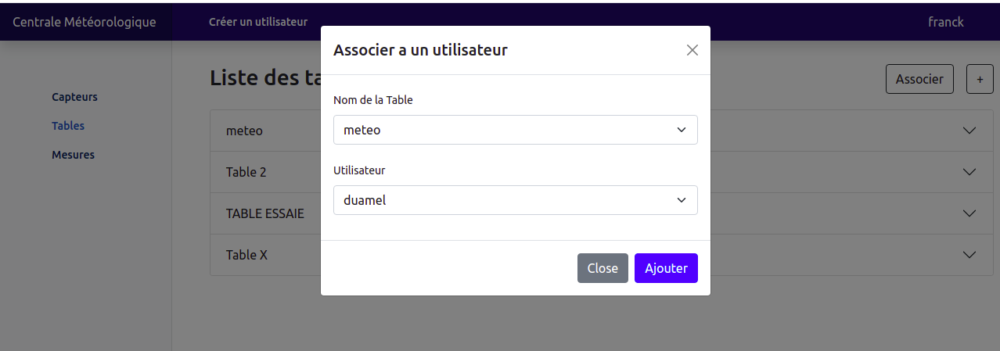
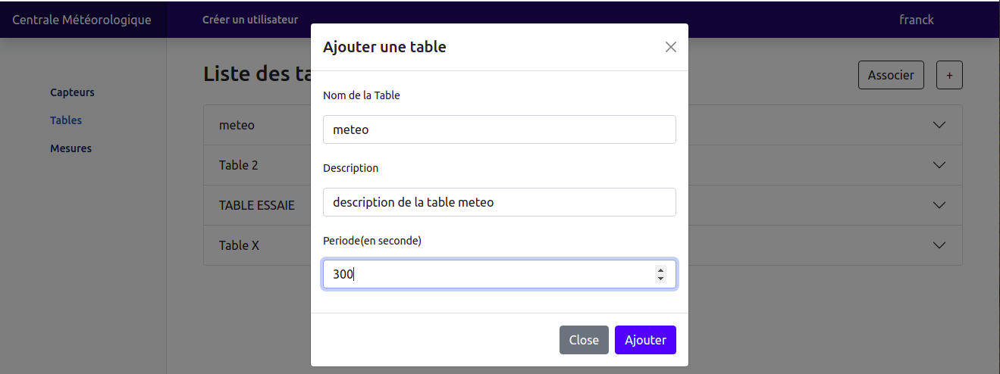
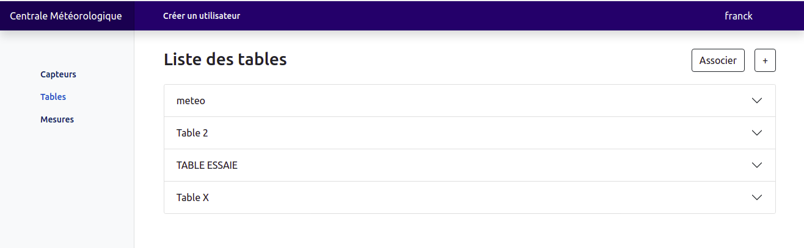
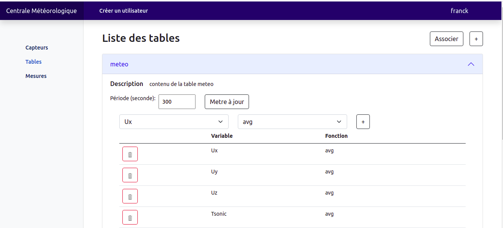
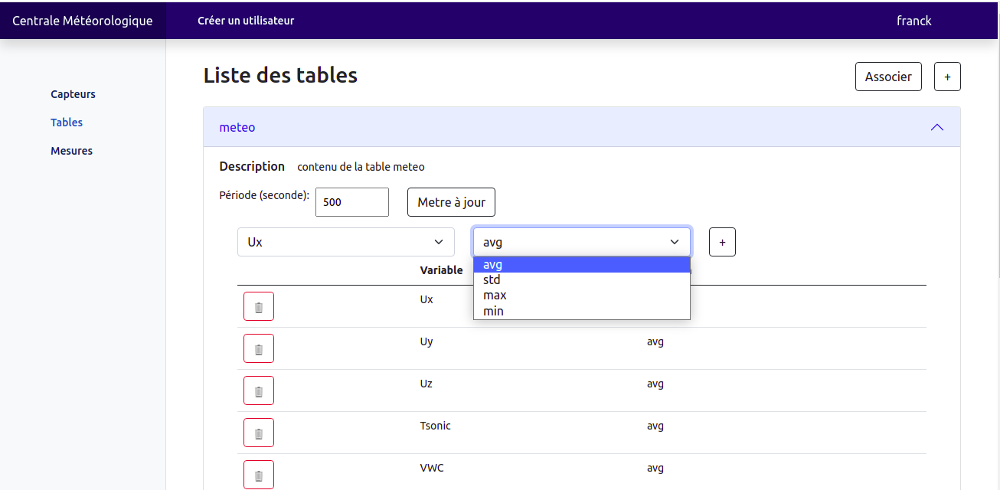
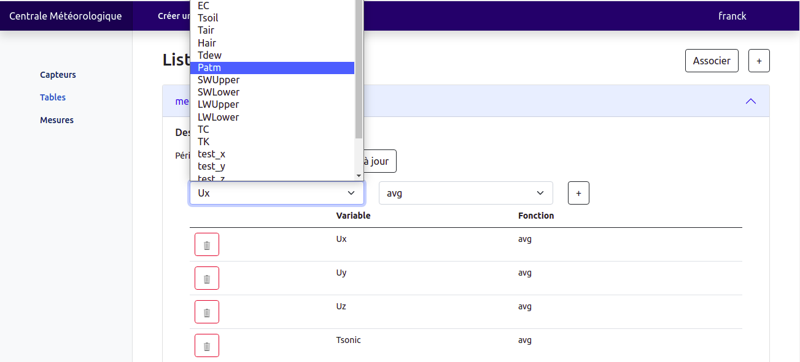

#  Présentation de la page **Liste des tables**

## Créer les utilisateurs

L'administrateur du système crée tous les autres utilisateurs du système en cliquant sur le lien **Créer un utilisateur**.

  
*Enregistrement d'un utilisateur.*

## Association

L'administrateur a la possibilité d'associer une table à un utilisateur du système, en cliquant sur le bouton **Associer**.

  
*Modal d'association table-utilisateur*

## Ajout d'une table

Selon les besoins des utilisateurs du système, l'adminitrateur peut ajouter une nouvelle table en renseignant certaines informations utiles en cliquant sur le bouton **+**.

  
*Modal d'ajout d'une table*

## Tables personnalisées

  
*Page des tables associées à l'utilisateur connecté.*

En cliquant sur un accordéon, vous pouvez consulter les informations d'une table

  
*Information de la table météo associée à l'utilisateur franck.*

Vous avez la possibilité de : 

- mettre à jour la période de la table en renseignant une nouvelle valeur dans le champ appropré, suivi d'un click sur le bouton **Mettre à jour***
- renseigner une nouvelle variable à la table avec une fonction associée.
- supprimer une variable de la table

  
*Opération possible sur la table météo.*

 
 
 
 

  
*Sélection d'une sortie.*

 
 
 
 

  
*Suppression de la sortie Ux*
